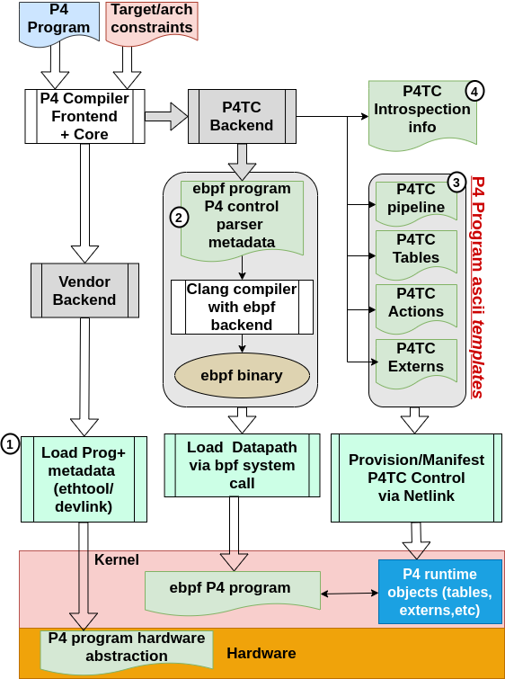
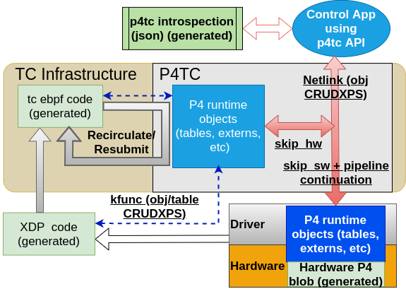

# Building Robust Control Planes With P4TC API

Modern network device architectures are traditionally split into three layers: hardware, the software datapath, and the software control plane.
Packet processing architectures on top of these layers are frequently tailored to the unique requirements of specific applications and organizations often with high degree of customization varying significantly based on internal culture and technical expertise. This is Conway’s Law in action: the system’s design mirrors the communication structure of the organization that builds it.

However, this customization often clashes with the rigid standards of upstream development and technological limitations:
*   **Hardware** is locked into fixed-function ASICs with multi-year development cycles.
*   **Software** (both datapath and control) is often trapped by inflexible deployment processes and long release cycles.

Today, implementing a new "custom" protocol requires a simultaneous, ground-up changes or worse a redesign across the entire stack—hardware ASICs, kernel code, and control logic.
[P4TC (P4 Traffic Control)](https://www.p4tc.dev/) breaks this cycle. By using [P4](https://www.p4.org/) as a standardized datapath definition language, P4TC ensures that **no new kernel or user-space code is needed to define a new datapath.** We enable the "scratching their own itch" principle, allowing Conway's Law to thrive without the technical debt of traditional integration.

This article, the third in our series, explores how P4TC leverages P4 to solve the final piece of the puzzle: building robust, customizable control plane interfaces. The article provides some brief background context, however, the reader would benefit by looking at the previous two articles. The [first article](https://www.p4tc.dev/blogs/why-p4tc.html)  discusses overall P4TC history, motivation and architecture. The [second article](https://www.p4tc.dev/blogs/ctrl-api-abstraction-part1.html) describes the netlink architecture.

This organizational reflection often leads to technical silos where hardware and software layers become rigid and difficult to evolve.

## Breaking the Rigidity of Traditional Layers

Figure 1 illustrates the P4TC workflow, showing how a single P4 program generates four distinct artifacts (highlighted in green):

1.  **Hardware Program:** Loaded directly into the hardware device.
2.  **eBPF Program:** Injected into the Linux kernel datapath.
3.  **Control Templates:** Objects that allow the P4 runtime to interact with the software.
4.  **JSON Introspection:** A file used by the P4TC runtime to understand the program's st

<figure>
  
  <figcaption>Figure 1: P4TC Workflow</figcaption>
</figure>

### Overcoming Hardware Rigidity
Instead of relying on vendor-mandated, "bottom-up" ASIC architectures, P4 enables a **"top-down" framework.** P4TC developers can specify their own datapaths and manage configurations directly via the control plane, shifting power from the hardware vendor to the network architect.

### Overcoming Datapath Software Rigidity
Integrating new packet-processing capabilities into the Linux kernel is notoriously slow and costly. As discussed in [Why P4TC?](https://www.p4tc.dev/blogs/why-p4tc.html), even simple updates to something like introducing a `tc flower` protocol header can take years to reach major distributions.

P4TC solves this by generating **eBPF bytecode** that is injected into TC and XDP kernel hooks (Step #2 in Figure 1). Because P4TC is embedded directly into TC, it provides a **unified control path** for both software and hardware objects (see Figure 2). This ensures that whether you are managing software logic or hardware offloads, you use the exact same interface.

> [!NOTE]
> P4TC simplifies eBPF execution by eliminating the "Verifier Battle." The `p4c-tc` compiler generates "known-good" code that the kernel trusts, allowing for complex networking logic without the risk of rejection by the eBPF verifier.

### Overcoming Runtime Control Path Rigidity

The P4TC control plane API is designed to support multiple transports between the control and datapath influenced by the ForCES concept of  *Transport Mapping Layer* (TML) (see: https://datatracker.ietf.org/doc/html/rfc5810#section-5 and https://datatracker.ietf.org/doc/html/rfc5811). The current implementation only supports *netlink* transport. You can read more about why we chose netlink in [Part 2 of this series](https://www.p4tc.dev/blogs/ctrl-api-abstraction-part1.html).

> [!TIP]
>
> **Why use Netlink instead of the eBPF system call?**
> While eBPF has its own control interface to update maps etc, it lacks the features required for robust control. Rather than re-inventing the wheel within eBPF—which would lead to years of development lag—P4TC leverages the maturity, experience, and hardware offload interfaces already present in the Linux `tc` infrastructure and Netlink.

<figure>
  
  <figcaption>Figure 2: P4TC Runtime</figcaption>
</figure>

Figure 2 highlights two game-changing features:
*   **Unified Datapath Management:** Use `skip_sw` or `skip_hw` flags to manage objects in either software or hardware through a single API.
*   **Program Introspection:** By using a JSON <u>data model</u> introspection file, we can build a **universal control application.** Because the API is "self-describing," the application can interpret the P4 program structure dynamically, eliminating the need for recompilation when new datapaths are added.

# Bootstrapping The P4 Program For Control

P4 was originally designed as a datapath definition language, with no native support for control paths. To bridge this gap, the P4TC backend uses **annotations**—metadata embedded directly in the P4 code—to define how control constructs should behave.

## P4TC Annotations: The "Glue"
Annotations act as the essential bridge between P4 logic and Linux TC. They guide the `p4c-tc` compiler in exposing datapath objects to the P4TC API via a **JSON introspection file.**

Let’s look at a simple example: `redirect_l2` (https://github.com/p4tc-dev/p4tc-examples-pub/tree/main/simple/redirect_l2). This program parses Ethernet IPv4 packets and uses the source IP to look up a next-hop in `nh_table`. On a hit, it rewrites MAC addresses and redirects the packet; on a miss, it drops the packet.

```P4
control ingress(
    inout my_ingress_headers_t  hdr,
    inout my_ingress_metadata_t meta,
    in    pna_main_input_metadata_t  istd,
    inout pna_main_output_metadata_t ostd
)
{
    // @tc_type maps P4 types to Linux-native formats (dev, macaddr, etc.)
    action send_nh(@tc_type("dev") PortId_t port_id, @tc_type("macaddr") bit<48> dmac, @tc_type("macaddr") bit<48> smac) {
         hdr.ethernet.srcAddr = smac;
         hdr.ethernet.dstAddr = dmac;
         send_to_port(port_id);
    }

    action drop() {
        drop_packet();
    }

    table nh_table {
        key = {
            // @name provides a user-friendly alias for the control API 
            hdr.ipv4.srcAddr : exact @tc_type("ipv4") @name("srcAddr");
        }
        actions = {
            @tableonly send_nh;
            drop;
        }
        size = REDIR_TABLE_SIZE;
        const default_action = drop;
    }

    apply {
        nh_table.apply();
    }
....
...
..
}
```

### Key Annotations in `redirect_l2`:
*   **`@tc_type`**: Maps P4 data to Linux-native types like `dev` (interface name), `macaddr` (48-bit hex), or `ipv4` (dotted-decimal). This enables the control plane to perform input validation and "pretty-print" values.
*   **`@name("srcAddr")`**: Creates a friendly alias. Instead of referencing the cumbersome `hdr.ipv4.srcAddr`, the control API can simply use `srcAddr`.
*   **`@tableonly`**: Restricts an action so it can only be used within table entries, not as a default action.

## P4TC Program Provisioning

The compiler produces a template script (refer to *step #3* in Figure 1) to manifest the control objects required for the P4 runtime to interface with the hardware and software datapaths (refer to **Figure 2**). This bash script utilizes the tc utility to execute netlink commands within the kernel. For the *redirect_l2* program, the output is as follows:

```bash
#!/bin/bash -x

set -e

: "${TC:="tc"}"
$TC p4template create pipeline/redirect_l2 numtables 1

$TC p4template create action/redirect_l2/ingress/send_nh actid 1 \
	param port_id type dev \
	param dmac type macaddr \
	param smac type macaddr
$TC p4template update action/redirect_l2/ingress/send_nh state active

$TC p4template create action/redirect_l2/ingress/drop actid 2
$TC p4template update action/redirect_l2/ingress/drop state active

$TC p4template create table/redirect_l2/ingress/nh_table \
	tblid 1 \
	type exact \
	keysz 32 permissions 0x3ca6 tentries 262144 nummasks 1 \
	table_acts act name redirect_l2/ingress/send_nh flags tableonly \
	act name redirect_l2/ingress/drop
$TC p4template update table/redirect_l2/ingress/nh_table default_miss_action permissions 0x1024 action redirect_l2/ingress/drop
$TC p4template update pipeline/redirect_l2 state ready
```

Once this script runs, the `redirect_l2` pipeline is live and ready for runtime control.

> [!NOTE]
>
> While the provisioning process will be detailed in a separate discussion, a reader cross-referencing the P4 program should be able to discern the functionality of the template from its structure.
>

## P4TC Introspection
Based on the P4 program above, the compiler generates a **JSON introspection file** as illustrated in Figure 1. This file allows the runtime to understand the structure of the P4 program without needing hardcoded logic (see Figure 2).

```json
{
  "schema_version" : "1.0.0",
  "pipeline_name" : "redirect_l2",
  "tables" : [
    {
      "name" : "ingress/nh_table",
      "id" : 1,
      "tentries" : 262144,
      "permissions" : "0x3ca6",
      "keysize" : 32,
      "keyfields" : [
        {
          "id" : 1, "name" : "srcAddr", "type" : "ipv4", "match_type" : "exact", "bitwidth" : 32
        }
      ],
      "actions" : [
        {
          "id" : 1,
          "name" : "ingress/send_nh",
          "action_scope" : "TableOnly",
          "params" : [
            { "id" : 1, "name" : "port_id", "type" : "dev", "bitwidth" : 32 },
            { "id" : 2, "name" : "dmac", "type" : "macaddr", "bitwidth" : 48 },
            { "id" : 3, "name" : "smac", "type" : "macaddr", "bitwidth" : 48
            }
          ],
          "default_hit_action" : false,
          "default_miss_action" : false
        },
        {
          "id" : 2,
          "name" : "ingress/drop",
          "action_scope" : "TableAndDefault",
          "default_miss_action" : true
        }
      ]
    }
  ]
}
```

Let's break down this definition:

- *pipeline_name* carries the program's name (in this case *redirect_l2*)
- There is a table *ingress/nh_table*:
  - allows a maximum of 262144 (REDIR_TABLE_SIZE) entries
  - has (default) permissions 0x3ca6(more on this when we later discuss the *@tc_acl*) annotation.
  - has a 32 bit exact key with a keyfield known as "srcAddr" which interpreted as a type *ipv4*
  - has two actions:
    - Action "ingress/send_nh" which is labelled as "TableOnly" (meaning it can only be used as a table action and not as default) takes 3 parameters:
      - parameter *port_id* of type *dev*
      - parameter *srcMac* of type *macaddr*
      - parameter *dstMac* of type *macaddr*
    - Action "ingress/drop" which takes no parameters. This action is labelled as "default_miss_action" - meaning if an entry is not found in the table this action will be executed.

### Why Introspection Matters:
The JSON data model file is the secret to **universal control planes.** Because the API is "self-describing," a single control application can manage any P4 program. It simply reads the JSON to learn which tables, keys, and actions are available. In other words the application code never changes.

# Introducing The P4TC API

The P4TC API is  a **resource-oriented Netlink interface**.
The interface follows a REST-inspired paradigm where every P4 object is a "noun" identified by a path, and operations are "verbs" aligning with CRUD+ semantics (Create, Read, Update, Delete, plus Event Subscription) with additional verbs for event subscription and unsubscription:

- **Create:** Add add one or more table entries or extern instances.
- **Read:** Retrieve one or more table entries or extern instances.
- **Update:** Modify existing table entries or extern instance.
- **Delete:** Delete one or more table entries or extern instances.
- **Subscribe**: Subscribe to a datapath event.
- **Unsubscribe**: Unsubscribe from a datapath event.

This approach allows to have a small set of verbs but infinite number of nouns, and is taken to avoid need to churn code every time a new object is introduced - which is  different compared to the traditional netlink rpc flavor approach where the verb is intertwined with the noun (see discussion in: https://www.p4tc.dev/blogs/ctrl-api-abstraction-part1.html)

This allows generic control applications (like `iproute2/tc`) to manage any P4 program without needing to be recompiled for specific P4 logic.

## P4TC CRUD+ Grammar

The following BNF grammar applies to API. The general syntax is of the form:

 \<**VERB**> \<**NOUN**> [**DATA**]+

### The Grammar at a Glance
```bnf
<COMMAND>    ::= <VERB> <NOUN> [<DATA>]+

<VERB>       ::= create | read (or get) | update | delete | subscribe | unsubscribe

<NOUN>       ::= <OBJTYPE> <PATH>
<OBJTYPE>    ::= table | extern
<PATH>       ::= <OBJECT NAME> [[key <KEYVAL>] | [filter <FILTERVAL>]]
```
### Understanding the Components

*   **Verbs:** are standard CRUD operations plus **subscribe/unsubscribe** for datapath events.
*   **Nouns:** are objects are identified by their type (`table` or `extern`) and their path in the P4 program.
*   **Keys:** are used for targeted lookups (e.g., a specific IP address in a table).
*   **Filters:** are powerful, SQL-like selectors used to perform mass operations (Read, Update, Delete) on entries that match specific criteria as well as selecting subsets of events (Subscribe).
*   **Data:** The parameters required for `create` or `update` operations (e.g., action and its parameters like `port_id`).

### More Details Of The Grammar

If as a human, you understood the BNF you can skip this section.

A **NOUN** consists of: **OBJTYPE** of the object followed by zero or more **PATH** to the object.

**OBJTYPE** is one of: **table** or **extern**

**PATH** is a path to the object which may optionally have a *key* or a *filter* qualifier.
**read** and **delete** can have zero or more **PATH**. When no **PATH** is present on the object it implies every entity in that object; for example all entries of a table object.


A *key* is used to do lookups and can only be a table key or an extern parameter annotated with attribute @tc_key in the generated json file.
A *key* can be used in verbs **create**, **read**, **update**, and **delete**.

- A key cannot be used in presence of a filter i.e they are mutually exclusive.
- When a key is used with **create**, it is an instruction to create a table or extern entry. A **create** MUST always have a key. A batch of entries can be created but each MUST carry a unique key - the only exception to key uniqueness is when a table allows entries to carry a priority field. In such a case the lookup key does not need to be unique because the priority field can be further used to disambiguate.
- When a key is optionally used with **read**, it is an instruction to read a specific table or extern entry specified by the key. When a key is missing in a **read** it implies the whole object (*dump*). Multiple keys can be present in a **read** - implying a batch of specific entries.
- When a key is used with **update**, it is an instruction to update a table or extern entry. An **update** MUST always have a key and action parameterization. Multiple keys can be present in an **update** to represent a batch of entries to be updated.
- When a key is used with **delete**, it is an instruction to delete table or extern entry. When a key is missing in a **delete** it implies the whole object (*flush*). Multiple keys can be present in a **delete** - implying a batch of specific entries.
- A key cannot be used with **subscribe** or **unsubscribe**.

A *filter* is like an sql *select* construct. It can be used in verbs **read**, **update**, **delete** and **subscribe** verbs.
A *filter* description can use both table keys and action parameters as well as metadata unrelated to the control objects.
- A filter can not be used with **create**
- A filter cannot be used with a key.
- When a filter is used with **read**, it is an instruction to read table or extern entries that match the filter description.
- When a filter is used with **update**, it is an instruction to update all table or extern entries that match the filter description.
- When a filter is used with **delete**, it is an instruction to delete all table or extern entries that match the filter description
- When used with the **subscribe** verb, the *filter* can include, in addition to a description of the table/extern and associated parameters, a verb in its construct. The verb can only be one of: **create**, **update** or **delete**.
- A filter cannot be used with **unsubscribe**.

**DATA** is optional depending on the verb. Only **create** and **update** have **DATA**.
**DATA** MUST be qualified by a key.

### Illustrating The P4TC CRUD+ Grammar

Using a conceptual command-line tool `p4tccli`, here is how you would interact with the `redirect_l2` program (We'll discuss the exact API details later):

```bash
CLI="./p4tccli"
PNAME="redirect_l2"
TNAME="ingress/nh_table"

#Subscribe to all events on table $TNAME. You will get back a subscription ID ($SUB_ID holds subscription id)
# "all events" means: Any time a table entry is created, updated or deleted you will get notification
$CLI $PNAME subscribe table $TNAME

#Create table entry with key srcAddr 192.168.1.1 (will generate create event)
#action ingress/send_nh to rewrite dmac to 00:11:22:33:44:55 smac to 66:77:88:99:AA:BB and send out port eth0
$CLI $PNAME create table $TNAME key srcAddr 192.168.1.1 action ingress/send_nh port_id eth0 dmac 00:11:22:33:44:55 smac 66:77:88:99:AA:BB

#Create table entry with key srcAddr 192.168.1.2 (will generate create event)
#action ingress/send_nh to drop
$CLI $PNAME create table $TNAME key srcAddr 192.168.1.2 action ingress/send_nh port_id eth0 dmac 00:11:55:44:33:22 smac 66:78:89:9A:AA:BB

#Read back table entry with key srcAddr 192.168.1.1
$CLI $PNAME read table $TNAME key srcAddr 192.168.1.1

#Dump all the table entries (should see two entries)
$CLI $PNAME read table $TNAME

#Update table entry for 192.168.1.1 to drop on match (will generate update event)
$CLI $PNAME update table $TNAME key srcAddr 192.168.1.1 action ingress/drop

#Delete the table entry for 192.168.1.1 (will generate a delete event)
$CLI $PNAME delete table $TNAME key srcAddr 192.168.1.1

#Flush all table entries (will generate one delete event)
$CLI $PNAME delete table $TNAME

#unsubscribe from all events on table $TNAME
$CLI $PNAME subscribe table $TNAME id $SUB_ID
```

## P4TC API Optimizations

To handle high-scale networking requirements, the P4TC control plane offers three primary scaling features: **Sharding**, **Batching**, and **Filtering**.

### 1. P4TC Control Sharding

Because P4TC uses Netlink, it inherits the ability to handle concurrent access. Multiple applications or threads can access control objects in the kernel simultaneously.

*   **Parallel Management:** Different threads can manage independent P4 objects or P4 programs (e.g., one thread manages `nh_table` while another manages a counter extern).
*   **Use Case:** In a multi-core control plane, you can shard your table entries across threads. For example, Thread A manages entries for the `10.0.0.0/8` prefix, while Thread B handles `192.168.0.0/16`, dramatically increasing the overall update rate.


### 2. P4TC CRUD+ Batching
Batching allows you to group multiple CRUD commands into a single system call. This significantly reduces the overhead of crossing the user-kernel boundary.

#### Batching Create

You can send a single request to create dozens or hundreds of table entries at once.

```bash
#lets subscribe to the table's events to track what is going on
$CLI $PNAME subscribe table $TNAME
#save the subscription ID
SUB_PID=$!
sleep 1
SUB_ID=$(grep "Subscription ID:" sub.out | awk '{print $3}')
echo "Saved Subscription ID: $SUB_ID"

#Batched creation of three entries in a single call (we should see 3 create events)
$CLI $PNAME create table $TNAME \
  key srcAddr 192.168.1.1 action ingress/send_nh port_id eth1 dmac 00:AA:BB:CC:DD:EE smac 11:22:33:44:11:11 \
  key srcAddr 192.168.1.2 action ingress/send_nh port_id eth1 dmac 00:AA:BB:CC:DD:EE smac 11:22:33:44:11:22 \
  key srcAddr 192.168.1.3 action ingress/drop

#dump the table (should see 3 entries)
$CLI $PNAME read table $TNAME
```

#### Batching Read With Keys

Similarly, you can update or delete multiple specific entries in one transaction by providing a list of keys.
Later on we'll show another approach using filters.

```bash
$CLI $PNAME read table $TNAME \
    key srcAddr 192.168.1.2 \
    key srcAddr 192.168.1.3
```

#### Batching Update

Similarly, you can update multiple specific entries in one transaction by providing a list of keys and what to portions of the data to change.
Later on we'll show another approach using filters.

```bash
#Update batched table entries (should see two update events)
$CLI $PNAME update table $TNAME \
  key srcAddr 192.168.1.2 action ingress/send_nh port_id eth0 dmac 00:BB:CC:DD:EE:11 smac 00:22:33:44:55:66 \
  key srcAddr 192.168.1.3 action ingress/send_nh port_id eth0 dmac FF:EE:DD:CC:BB:AA smac 99:88:77:66:55:44
```

#### Batching Delete With Keys

Similarly, you can selectively delete multiple specific entries in one transaction by providing a list of keys.
Note: if we didnt specify the keys below we can delete the whole table.

Later on we'll show another approach using filters.

```bash
#selectively delete these two entries (we should see two delete events)
$CLI $PNAME delete table $TNAME \
    key srcAddr 192.168.1.2 \
    key srcAddr 192.168.1.3
```

### 3. P4TC CRUD+ Filters

Filters are the most powerful scaling feature in P4TC. They allow you to perform mass operations based on data values rather than just keys, similar to an SQL `WHERE` clause.
Filters follow a DSL - which requires a separate discussion; our goal in this document is to illustrate the power of using such filters to scale control operations.

Filters apply to different constructs full or partial table keys and extern keys, full or partial table entry action parameter values, and extern parameter values.

For purposes of illustration, consider a scenario where the "ingress/nh_table" contains one million entries. Within this table, assume that 50,000 entries designate "eth0" as their *port_id* action, while another 50,000 entries are directed to *port_id* "eth1".

#### Selective Mass *Read*/*Update*/*Delete* Operations With Filters

Let's illustrate these features using filtering for action *send_nh* *port_id* parameter value.

```bash
#Subscribe to table events with filter for $TNAME so we can keep track of state change
$CLI $PNAME subscribe table $TNAME  > sub.out 2>&1 &
SUB_PID=$!
SUB_ID=$(grep "Subscription ID:" sub.out | awk '{print $3}')

#Read table with filter - should return 50K entries
$CLI $PNAME read table $TNAME filter param.act.ingress.send_nh.port_id = eth0

# Update entries with send_nh.port_id = "eth0" to change the action to a drop. Should update 50K entries (we will get 50K events)
$CLI $PNAME update table $TNAME filter param.act.ingress.send_nh.port_id = eth0 action ingress/drop

# Delete all entries with send_nh.port_id = "eth1". should delete 50K entries (we will get 50K events)
$CLI $PNAME delete table $TNAME filter param.act.ingress.send_nh.port_id = eth1

$CLI $PNAME unsubscribe table $TNAME id $SUB_ID
kill $SUB_PID
rm sub.out
```

#### Filtered Subscriptions

As may be observed above we receive a lot of events when we are doing mass update/delete. We can mitigate this with a control app only subscribing to a subset of events. To scale this further we can have multiple applications or threads filtering selective events.

```bash
#Subscribe to table events with filter for matching only when action port_id = "eth0"
$CLI $PNAME subscribe table $TNAME param.act.ingress.send_nh.port_id = \"eth0\" > sub.out 2>&1 &

#Flush table entries. We should see 50K delete events (with action port_id = "eth0") even though we have deleted 1M entries
$CLI $PNAME delete table $TNAME

$CLI $PNAME unsubscribe table $TNAME id $SUB_ID
```
#### More Advanced Filters

P4TC filters support complex expressions, metadata, and logical operators (`&&`, `||`, `!`).
*   **Time-based:** `delete table nh_table filter "msecs_since > 30000"` (Delete entries which have been idle for > 30s).
*   **Complex logic:** `read table nh_table filter "param.port_id = eth0 || param.port_id = eth1"`

```bash
#Read all entries where the action parameter for port_id is not eth0
CLI $PNAME read table $TNAME filter param.act.ingress.send_nh.port_id != eth0

#Delete table entries which have not see any activity for over 30 seconds
$CLI $PNAME delete table $TNAME filter msecs_since > 30000

#Read entries which have port_id = eth0 but last used < 10s ago
$CLI $PNAME read table $TNAME filter param.act.ingress.send_nh.port_id = eth0 && msecs_since < 10000

#read entries that have port_id as eth0 or eth1
$CLI $PNAME read table $TNAME filter param.act.ingress.send_nh.port_id = eth0 || param.act.ingress.send_nh.port_id = eth1

#update all entries with port_id = eth0 and dmac != b8:ce:f6:4b:68:35 that have not seen traffic in more than 30 seconds to have a new action drop
$CLI $PNAME update table filter $TNAME (param.act.ingress.send_nh.port_id = eth0 && param.act.ingress.send_nh.dmac != b8:ce:f6:4b:68:35 && msecs_since > 30000) action ingress/drop

#Subscribe to table events with filter for matching only when action port_id = "eth0" and it is a **create** verb
$CLI $PNAME subscribe table filter $TNAME cmd = create && param.act.ingress.send_nh.port_id = \"eth0\"
```

## P4TC Runtime API: Identity And Permissions

**Identity** is a 32 bit id that is used to identify the control plane source that is updating table or extern state.
In the long run we would like to see some authentication and authorization of each identity before they are allowed to interact with the datapath.
At the moment there are default reserved IDs which are defined in file */etc/iproute2/p4tc_entities*

| ID | Entity | Description |
| :--- | :--- | :--- |
| 0 | unspec | Unspecified |
| 1 | kernel | Linux Kernel |
| 2 | tc | Traffic Control |
| 3 | timer | Kernel Timer |

The kernel, tc and kernel timer (for dynamic entries which expire) have reserved identities.
A control plane implementation can add a new set of identities by placing a file with  .conf extension with */etc/iproute2/p4tc_entities_d*
Example:

```
cat /etc/iproute2/p4tc_entities.d/p4tccli.conf
186  p4tccli
```

Lets dump a single entry from *redirect_l2* table *ingress/nh_table* to illustrate the different identities.

```

[
  {
    "pname": "redirect_l2",
    "pipeid": 1
  },
  {
    "entries": [
      {
        "tblname": "ingress/nh_table",
        "key": [ {...}],
        "actions": {
          "actions": [{...}]
        },
        "create_whodunnit": "tc", //application is using TC as identity
        "create_whodunnit_id": 2, // TC is identity 2.
        "who_created_pid": 522,  // the entry was created by processid 522
        "who_created": "p4tccli", // the name of the process was p4tccli
        "update_whodunnit": "tc",
        "update_whodunnit_id": 2,
        "who_updated_pid": 525, // entry was updated by process id 525
        "who_updated": "p4tccli", // the process name was "p4tcli"
        "dynamic": "false",
        "created": 7,        // this entry was created 7 seconds ago
        "last_used": 6,      // it was last used 6 seconds ago
      }
    ]
  }
]
```

### Object Permissions: @tc_acl
*@tc_acl* annotation is used to define the object access control information.
The compiler uses this information to provide details to the template and json introspection file.
The format *CRUDXPS*(Create, Read, Update, Delete, eXecute, Publish, Subscribe) in quotes is used in the annotation in the form of **"Control plane ACL":"Datapath ACL"**. When not specified, the default values are assumed.
For the control plane the default is <u>**CRUDS**</u> and for the datapath the default is <u>**RXP**</u>. The compiler generates the numeric values in the introspection as well as template outputs.

At the moment the only events supported are announcements to changes to the shared control data. For example, if an update happens from either the control or datapath, then the control plane applications which subscribed to events will get notified. Current events that can be generated are for *Create*, *Update* and *Delete* operations to an extern. All published events in P4TC carry an *identity* "whodunnit" field which indicates who/what entity initiated the change for which the event is reported.

For the sake of this article, lets focus on tables; however, everything discussed here applies to externs as well (to be discussed in the next article).

There are two types of table permissions:
 - Table permissions which are a property of the table (think directory in file systems). These are defined by the template.
 - Table entry permissions which are specific to a table entry (think a file in a directory).

Furthermore in both cases the permissions are split into datapath vs control path. The template definition can set either one. For example, one could allow for the datapath to add/delete table entries in case of PNA add-on-miss is needed. 

#### Table Permissions

Tables can have permissions which apply to all the entries in the specified table. Permissions are defined for both what the control plane (user space)
as well as the data path are allowed to do.

The permissions field is a 16bit value which will hold CRUDXPS (create, read, update, delete, execute, publish and subscribe) permissions for control and data path. Bits 13-7 will have the CRUDXPS values for control and bits 6-0 will have CRUDXPS values for data path. By default each table has the following permissions:

   *CRUD--S-R--XP-*

Which means the control plane can perform CRUDPS operations whereas the data path can only Read and execute on the entries.

Lets dump the template for *redirect_l2*:
```
[
  {
    "obj": "table",
    "pname": "redirect_l2",
    "pipeid": 1,
    "tblid": 1,
    "tname": "ingress/nh_table",
    "keysz": 32,
    "max_entries": 262144,
    "permissions": "CRUD--S-R--XP-",
  }
]
```

Clearly the control plane is allowed to Create, Read, Update, Delete and Subscribe on this table whereas the datapath can Read, Execute and Publish.

#### Table Entry Permissions

By default all table entries inherit the table permissions. Let's *read* and entry from *redirect_l2*:

```

[
  {
    "pname": "redirect_l2",
    "pipeid": 1
  },
  {
    "entries": [
      {
        "tblname": "ingress/nh_table",
        "tblid": 1,
        "permissions": "CRUD--S-R--XP-",
        "key": [
          {
            "keyfield": "srcAddr",
            "id": 1,
            "width": 32,
            "type": "ipv4",
            "match_type": "exact",
            "fieldval": "192.168.1.2/32"
          }
        ],
        "actions": {
          "actions": [
            {
              "order": 1,
              "kind": "redirect_l2/ingress/drop",
              "index": 4,
            }
          ]
        },
        ...
        ...
      }
    ]
  }
]
```

however, the control plane can specify permissions when adding entries to override the table permissions. Lets say a table has **CRUD----R--X--** permissions as defined by the template. At runtime the user could add entries which are "const" - by specifying the entry's permission as **-R------R--X--**.

An interesting example is the famous calc program (https://github.com/p4tc-dev/p4tc-examples-pub/blob/main/calc/calc.p4) which has constant table entries.


```
    table calculate {
        key = {
            hdr.p4calc.op        : exact @name("op");
        }
        actions = {
            operation_add;
            operation_sub;
            operation_and;
            operation_or;
            operation_xor;
            operation_drop;
        }
        const default_action = operation_drop();
        const entries = {
            P4CALC_PLUS : operation_add();
            P4CALC_MINUS: operation_sub();
            P4CALC_AND  : operation_and();
            P4CALC_OR   : operation_or();
            P4CALC_CARET: operation_xor();
        }
    }
```

Let's see the permissions on the entries for calc for one of the entries when we read it at runtime:

```

[
  {
    "pname": "calc",
    "pipeid": 1
  },
  {
    "entries": [
      {
        "tblname": "MainControlImpl/calculate",
        "tblid": 1,
        "prio": 64000,
        "permissions": "-R------R--X--",
        "key": [
          {
            "keyfield": "op",
            "id": 1,
            "width": 8,
            "type": "bit8",
            "match_type": "exact",
            "fieldval": "43/0xff"
          }
        ],
        "actions": {
          "actions": [
            {
              "order": 1,
              "kind": "calc/MainControlImpl/operation_add",
              "index": 1,
              "ref": 1,
              "bind": 1,
              "params": []
            }
          ]
        },
        "create_whodunnit": "tc",
        "create_whodunnit_id": 2,
        "who_created_pid": 628,
        "who_created": "tc",
        "dynamic": "false",
        "created": 3212,
        "last_used": 3212,
        "tmpl_created": "true"
    ]
  }
]
```

> [!NOTE]
>
> These table entries cannot be updated or deleted at runtime. Any attempt to add an entry of a table which is read-only at runtime will get a permission denied response back from the kernel.
>


## P4TC Runtime API: Lifecycle of Operations

This document describes the end-to-end workflow of P4TC operations, using the `redirect_l2` example for illustration.

---

### 1. General Preparation Stage

Every operation begins with initializing the environment and staging binary data.

#### A. Context and Provisioning
```c

// Create the runtime context (Netlink transport)
struct p4tc_runt_ctx *ctx = p4tc_runt_ctx_create(P4TC_TML_OPS_NL);
```

#### B. The Object Container
```c
// Create a container for Table operations
struct p4tc_obj *obj = p4tc_obj_create("redirect_l2", P4TC_OBJ_RUNTIME_TABLE);

// Create a container for extern operations
struct p4tc_obj *obj = p4tc_obj_create("myprog", P4TC_OBJ_RUNTIME_EXTERN);

```

---

### 2. Implementation Patterns by Operation

#### A. Create Table Entries (including Batching)
Stages one or more keys and actions, then sends them to the datapath in a single transaction.
```c
p4tc_obj_objname_set(obj, "ingress/nh_table");

// Entry 1
struct p4tc_key *key1 = p4tc_make_key(obj, "192.168.1.1");
struct p4tc_runt_tbl_attrs *entry1 = p4tc_alloc_tbl_entry(obj, key1, 0, P4TC_ENTITY_TC);
p4tc_create_runt_act(entry1, "ingress/send_nh", "eth0", "00:11:22:33:44:55", "66:77:88:99:AA:BB");

// Entry 2 (Batching)
struct p4tc_key *key2 = p4tc_make_key(obj, "192.168.1.2");
struct p4tc_runt_tbl_attrs *entry2 = p4tc_alloc_tbl_entry(obj, key2, 0, P4TC_ENTITY_TC);
p4tc_create_runt_act(entry2, "ingress/drop");

// Invoke and Confirm for the entire batch
if (p4tc_create(ctx, obj, 0, NULL, NULL) == 0) {
    p4tc_resp_handle(ctx); // Blocks for ACK
}
```

#### B. Update Entries (Key or Filter)
Updates can be targeted using either a specific entry key or a filter. These methods are mutually exclusive for a single operation.

```c
// Pattern 1: Update by Key
p4tc_obj_objname_set(obj, "ingress/nh_table");
struct p4tc_key *key = p4tc_make_key(obj, "192.168.1.1");
struct p4tc_runt_tbl_attrs *entry = p4tc_alloc_tbl_entry(obj, key, 0, P4TC_ENTITY_TC);
p4tc_create_runt_act(entry, "ingress/drop");

p4tc_update(ctx, obj, 0, NULL, NULL);
p4tc_resp_handle(ctx);

// Pattern 2: Update by Filter (Mass Update)
struct p4tc_obj *filter_obj = p4tc_obj_create("redirect_l2", P4TC_OBJ_RUNTIME_TABLE);
p4tc_obj_objname_set(filter_obj, "ingress/nh_table");
p4tc_obj_filter_set(filter_obj, "param.act.ingress.send_nh.port_id = eth0");

struct p4tc_runt_tbl_attrs *f_entry = p4tc_alloc_tbl_entry(filter_obj, NULL, 0, P4TC_ENTITY_TC);
p4tc_create_runt_act(f_entry, "ingress/drop");

p4tc_update(ctx, filter_obj, 0, NULL, NULL);
p4tc_resp_handle(ctx);
```

#### C. Get/Read Operations
*   **Single Entry:** Use a key to fetch one specific entry.
*   **Selective Entries**: Specify individual keys in a batch
*   **Filtered Read:** Use a filter string to fetch matching entries.
*   **Dump:** No key and no filter fetches all entries.
```c
// Pattern 1: Single Entry
p4tc_obj_objname_set(obj, "ingress/nh_table");
struct p4tc_key *key = p4tc_make_key(obj, "192.168.1.1");
p4tc_alloc_tbl_entry(obj, key, 0, P4TC_ENTITY_TC);
p4tc_get(ctx, obj, 0, my_callback, NULL);
p4tc_resp_handle(ctx);

// Pattern 2: Filtered Read
struct p4tc_obj *f_obj = p4tc_obj_create("redirect_l2", P4TC_OBJ_RUNTIME_TABLE);
p4tc_obj_objname_set(f_obj, "ingress/nh_table");
p4tc_obj_filter_set(f_obj, "prio = 1");
p4tc_get(ctx, f_obj, 0, my_callback, NULL);
p4tc_resp_handle(ctx);

// Pattern 3: Table Dump (No key or filter)
p4tc_obj_objname_set(obj, "ingress/nh_table");
p4tc_get(ctx, obj, 0, my_callback, NULL); // ROOT flag is automatically applied
p4tc_resp_handle(ctx);
```

#### D. Delete Operations
*   **Single Entry:** Use a key to remove one specific entry.
*   **Selective Entries**: Specify individual keys in a batch
*   **Filtered Delete:** Use a filter to remove matching entries.
*   **Flush:** No key and no filter clears the entire table.
```c
// Pattern 1: Single Delete
p4tc_obj_objname_set(obj, "ingress/nh_table");
struct p4tc_key *key = p4tc_make_key(obj, "192.168.1.1");
p4tc_alloc_tbl_entry(obj, key, 0, P4TC_ENTITY_TC);
p4tc_del(ctx, obj, P4TC_MSG_ACK, NULL, NULL);
p4tc_resp_handle(ctx);

// Pattern 2: Filtered Delete (Mass Delete)
p4tc_obj_filter_set(obj, "param.act.ingress.send_nh.port_id = eth1");
p4tc_del(ctx, obj, 0, NULL, NULL);
p4tc_resp_handle(ctx);

// Pattern 3: Table Flush (No key or filter)
p4tc_obj_objname_set(obj, "ingress/nh_table");
p4tc_del(ctx, obj, P4TC_MSG_ACK, NULL, NULL); // ROOT flag is automatically applied
p4tc_resp_handle(ctx);
```

#### E. Subscription Management
Subscriptions can be narrowed using filters to only receive events for specific entries.
```c
// 1. Subscribe to events on nh_table matching a filter
p4tc_obj_objname_set(obj, "ingress/nh_table");
p4tc_obj_filter_set(obj, "key.srcAddr = \"192.168.1.2\"");
int sub_id = p4tc_subscribe(ctx, obj, 0, my_event_callback, NULL);

if (sub_id > 0) {
    // 2. Start background event listener
    p4tc_subscribe_resp_handle(ctx, sub_id);

    // ... wait or perform other work ...

    // 3. Unsubscribe when finished
    p4tc_unsubscribe(ctx, sub_id);
}
```

---

### 3. Parameter and Callback Reference

The parameters used in `p4tc_XXX()` and the logic in the resulting callback differ based on whether you are dealing with a single entry or multiple.

#### Common Parameters
*   **`cookie`**: An optional `__u64` value (or pointer cast to `__u64*`) passed to the API. It is returned unmodified to your callback, allowing you to track which request is being processed.

#### The Callback Lifecycle (`p4tc_callback`)
The callback is triggered by `p4tc_resp_handle()` and receives the data retrieved from the datapath. The `trans_phase` and `p4tc_obj` parameters tell you the status of the retrieval.

##### Single Entry Pattern
When fetching one entry, the callback is usually triggered once or twice:
1.  **`P4TC_PHASE_SOT`**: The data for the requested entry is present in `p4tc_obj`.
2.  **`P4TC_PHASE_EOT`**: The transaction is complete. `p4tc_obj` is typically `NULL`.

##### Table Dump Pattern
When performing a dump, the callback is triggered for **every entry** in the table:
1.  **`P4TC_PHASE_SOT`**: Triggered for the **first entry** found. `p4tc_obj` contains this entry.
2.  **`P4TC_PHASE_MOT`**: Triggered for all **subsequent entries**. Each call contains exactly one entry in `p4tc_obj`.
3.  **`P4TC_PHASE_EOT`**: Triggered after the final entry has been delivered. `p4tc_obj` is `NULL`.
4.  **`P4TC_PHASE_ABT`**: Triggered if the dump was interrupted or failed.

#### Sample Implementation
This example handles both single-entry and multi-entry results for `redirect_l2`:

```c
int my_get_callback(const struct p4tc_obj *p4tc_obj, struct p4tc_runt_ctx *ctx,
                    __u64 *cookie, enum p4tc_trans_phase trans_phase)
{
    const char *label = (const char *)cookie;

    switch (trans_phase) {
    case P4TC_PHASE_SOT:
        printf("[%s] Beginning data reception...\n", label);
        /* Fall through: SOT also carries the first entry */
    case P4TC_PHASE_MOT:
        if (p4tc_obj) {
            // Process the entry (e.g., print it)
            printf("[%s] Entry found:\n", label);
            p4tc_obj_dump(p4tc_obj);
        }
        break;
    case P4TC_PHASE_EOT:
        printf("[%s] All data received successfully.\n", label);
        break;
    case P4TC_PHASE_ABT:
        fprintf(stderr, "[%s] Operation failed or was aborted.\n", label);
        return -1;
    }
    return 0;
}
```


# Appendix 1: P4TC Supported Annotations And Types

These annotations are specific to the TC backend and are typically prefixed with `tc_`.

The following annotations apply to externs.

| Annotation             | Description                                                  |
| :--------------------- | :----------------------------------------------------------- |
| **`@tc_data`**         | Marks a field in a control path struct as action data (parameters). |
| **`@tc_data_scalar`**  | A variation of `@tc_data` used specifically for scalar action data values. |
| **`@tc_numel`**        | Defines the capacity or number of elements for an extern (e.g., the size of a counter array or table). |
| **`@tc_init_val`**     | Specifies the initial value for a TC entity (e.g., an extern's starting state). |
| **`@tc_ControlPath`**  | Identifies P4 elements (tables/actions) that should be exposed to or managed by the control path. |
| **`@tc_may_override`** | Used with default actions to indicate that the control plane is allowed to override them at runtime. |
| **`@tc_md_read`**      | Identifies metadata fields that the P4 program expects to read from the TC metadata area. |
| **`@tc_md_write`**     | Identifies metadata fields that the P4 program is allowed to write to in the TC context. |
| **`@tc_md_exec`**      | Identifies metadata that influences execution flow or is used within a specific execution context. |


The following annotations apply to all.
| Annotation               | Description                                                  |
| :----------------------- | :----------------------------------------------------------- |
| **`@tc_type`**         | Maps a P4 data type to a TC-native type (e.g., `macaddr`, `ipv4`, `ipv6`, `be16`, `be32`, `be64`, `dev`). Used on action parameters or struct fields. This allows the control plane to perform proper input validation and pretty-printing. |
| **`@tc_acl`**            | **Access Control:** Defines permissions for a table or extern, specifying accessibility from the Control Path (Netlink) vs. Data Path (P4 code). |
| **`@tc_key`**          | Explicitly marks a field in a control path struct as a match key. |
| **`@nummask`**           | **Resource Hint:** Specifies the maximum number of unique masks allowed for a ternary match table, helping the backend stay within kernel/hardware constraints. |
| **`@default_hit`**       | **Hit Behavior:** Designates an action as the default behavior when a table lookup results in a match ("hit"). |
| **`@default_hit_const`** | **Fixed Hit Behavior:** Indicates that the default hit action is constant and cannot be modified by the control plane. |
| **`@tableonly`**         | **Action Constraint:** Restricts an action to be used only as a regular table entry. |
| **`@defaultonly`**       | **Action Constraint:** Restricts an action to be used only as a default action. |
| **`@name`**              | **External Identity:** Provides an explicit external name for an object, overriding the internal P4 identifier for user-facing tools. |

### Supported Match Types
The backend supports the following table match types, mapped to TC's internal classifier logic are defined in *include/uapi/linux/p4tc.h*  enum *p4_tc_match_type*

| Match Type | TC Constant | Description |
| :--- | :--- | :--- |
| **`exact`** | `P4TC_MATCH_TYPE_EXACT` | Exact value match. |
| **`lpm`** | `P4TC_MATCH_TYPE_LPM` | Longest Prefix Match. Has value and mask. |
| **`ternary`** | `P4TC_MATCH_TYPE_TERNARY` | Ternary match using value and mask. |

### Supported Data Types

The P4 `tc` backend supports, in addition to P4 datatypes, a specific set of data types that are mapped from P4 to TC-native representations. TC specific data types are defined in *include/uapi/linux/p4tc.h*
These types can be specified using the `@tc_type("type_name")` annotation on table keys, action parameters, or struct fields.

P4 bit types bit<X> which are not part of the ones listed above are supported as type *bitX* where X is an arbitrary number unless overridden by the *@tc_type* annotation - for example the action *send_nh()* parameter *dmac*  is described as *@tc_type("macaddr") bit<48> dmac* - making it available to the p4tc control api in a Colon-Hexadecimal format.

| Type Name | Description |
| :--- | :--- |
| **`dev`** | Represents a network interface/device name in human readable linux naming convention e.g "eth0" |
| **`macaddr`** | Represents a 48-bit Ethernet MAC address Colon-Hexadecimal format i.e. Six pairs separated by colons (e.g., 00:40:96:81:4A:2B). |
| **`ipv4`** | Represents a 32-bit IPv4 address in dotted-decimal notation as four decimal numbers (octets), each ranging from 0 to 255, separated by periods (e.g., \(192.168.1.1\)) |
| **`ipv6`** | Represents a 128-bit IPv6 address represented as eight groups of four hexadecimal digits, separated by colons (`:`), such as `2001:0db8:85a3:0000:0000:8a2e:0370:7334`. Addresses can be simplified by removing leading zeros in any group and replacing a single, consecutive string of all-zero groups with a double colon (`::`) |
| **`bitX`** | Standard P4 bitstring (default type). See discussion below |
| **`bit8`** | P4 type bit8 unsigned integer. |
| **`bit16`** | P4 type bit16 unsigned integer. |
| **`bit32`** | P4 type bit32 unsigned integer. |
| **`bit64`** | P4 type bit64 unsigned integer. |
| **`bit128`** | P4 type bit128 unsigned integer. |
| **`int8`** | 8 bit signed integer. |
| **`int16`** | 16 bit signed integer. |
| **`int32`** | 32 bit signed integer. |
| **`int64`** | 64 bit signed integer. |
| **`int128`** | 128 bit signed integer. |
| **`be16`** | 16-bit Big-Endian integer. |
| **`be32`** | 32-bit Big-Endian integer. |
| **`be64`** | 64-bit Big-Endian integer. |
| **`string`** | null terminated string. |
| **`bool`** |  boolean. |

---

By combining P4's expressive datapath definition with a mature, resource-oriented control API, P4TC provides the final piece of the puzzle for building truly flexible, high-performance network stacks in Linux.

