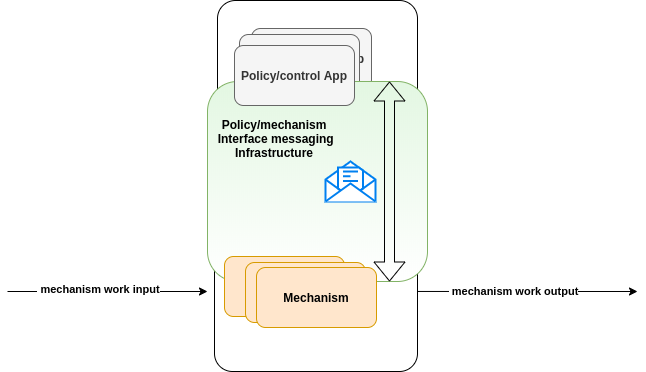
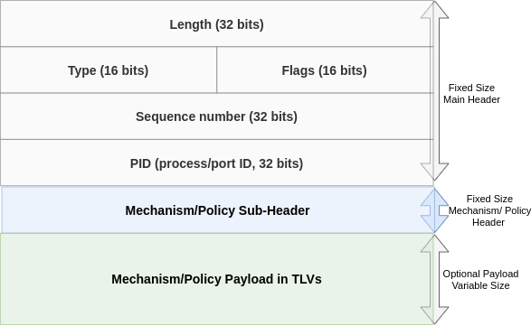
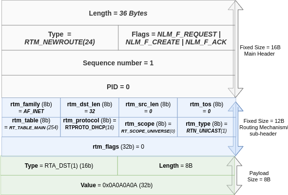
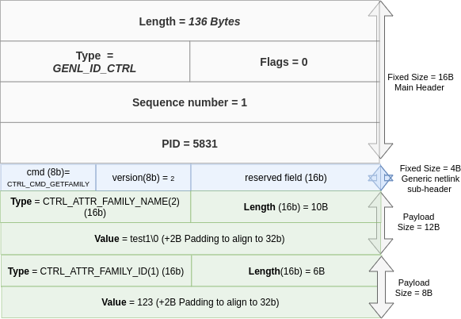
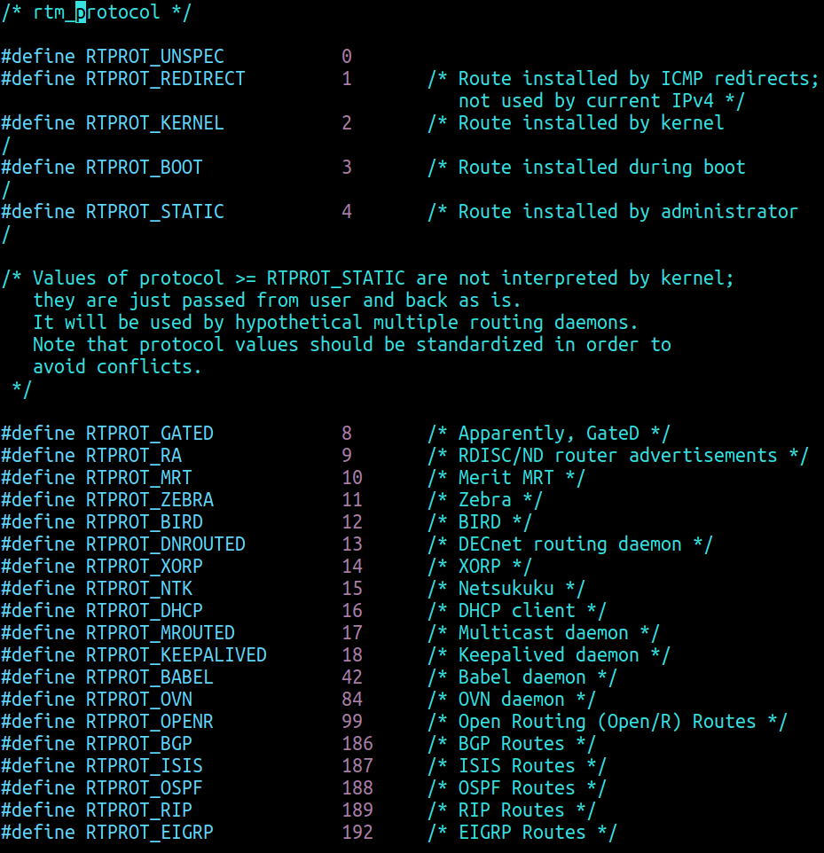
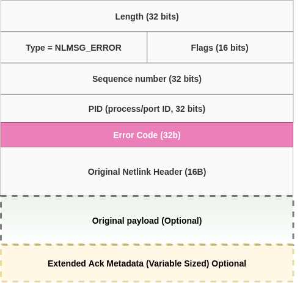
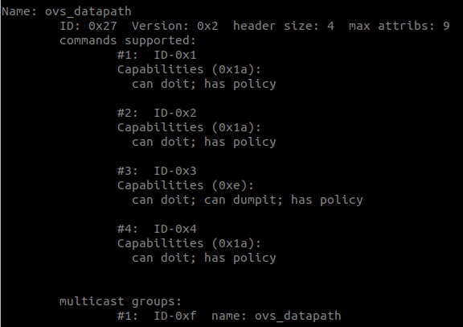
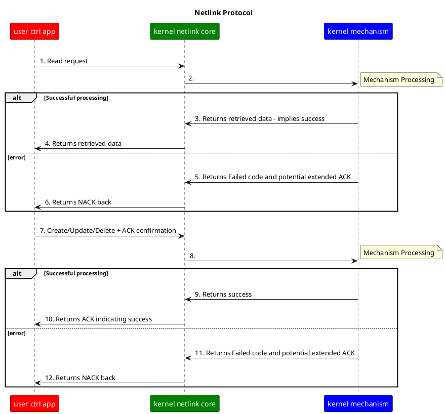

# Designing Robust Control Planes: The Netlink Messaging Infrastructure

The late Per Brinch Hansen[1] is credited for introducing the computer science core design principle of the separation of "mechanism" and "policy"[2]. This principle dictates that <u>**the fundamental operations or capabilities of a system (the *mechanism*) should be distinct from the rules or decisions about how those capabilities are utilized (the *policy*)**</u>.

## Control API Abstraction: The Separation of Mechanism And Policy

*Figure1* illustrates the separation of concern between the two entities: Policy at the top and mechanism at the bottom. These entities communicate through a defined interface  labelled as "Policy/mechanism Interface messaging Infrastructure".

<figure>
  
  <figcaption>Figure1: Separation Of Mechanism From Control</figcaption>
</figure>
Key benefits of this separation include:

- **Stability**: Changing one entity does not destabilize the other.
- **Independent Evolution**: Each entity's infrastructure can evolve separately.
- **Feature Agility**: New policy features can be enabled without modifying the underlying mechanism implementation

### Historical Context: Unix and the X Windows Exception

The success of Unix is largely attributed to its adherence to this rule of separation[8]. However, there are notable exceptions in Unix history. The X Windows subsystem is often cited as a "failing" or "wrong turn" because, while it provided a mechanism for basic windowing and network transparency, it was essentially "policy-free"

This "policy-free" approach led to a fragmented ecosystem where every application implemented its own policy, resulting in significant inconsistencies in user experience—issues that modern systems like Wayland are currently attempting to resolve. *Marcus J. Ranum* humorously critiqued this approach and its consequences:

> ***If the designers of X-Windows built cars, there would be no fewer than five steering wheels hidden about the cockpit, none of  which followed the same principles -- but you'd be able to shift gears with your car stereo. Useful feature, that.***

Networking Separation Of Concern
================================

In the networking world, the "mechanism" maps to the network data/fast path, while "policy" maps to the control plane applications. This article focuses on Linux networking, specifically on **Netlink** [20][10] which is the infrastructure that facilitates this separation (the middle box in *Figure1*).

*Netlink*  is a good poster-child of a well-thought mechanism/policy separation. By examining Netlink's features in this article, we can identify the requirements for a robust control abstraction.

> [!IMPORTANT]
>
> The primary goal of this document is to define the architectural concepts of an effective control-datapath separation using Netlink. It focuses on high-level design rather than low-level implementation details.
>
> This is the first in a series of three documents. Since P4TC[25] relies on Netlink, this document serves as the foundational material for **Part 2**, which will detail the P4TC control-datapath architecture. **Part 3** will subsequently cover the P4TC architecture for P4 externs, including the specific extensions required for control-datapath separation.

So What Is A Good Control Abstraction?
=======================================

There are 3 elements that are integral for mechanism/policy control separation (see *Figure1*):

##### **1. The control application illustrated as "Policy/Control App" in *Figure1*.**

Control plane applications handle rich and complex semantic logic. To provide an analogy to the human body, this layer is the brain. It consults many variables to reach its decisions and dictates *how* and *when* work is to be executed to achieve a desired goal.  For example, a CLI like *iproute2* translates diverse, human-readable directives into low-level Netlink constructs, which are then relayed to the specific mechanisms.

The control plane interface **MUST** be structured such that all complex logic is implemented at the application layer allowing the underlying mechanisms to focus purely on execution.

##### **2. The mechanism illustrated as "Mechanism" in *Figure1*.**

The mechanism is the work machinery. To build on the human body analogy, a mechanism could be, for example, a leg muscle which could be instructed by the brain (control plane) to contract and force a leg's movement. The mechanism essentially defines the *what* of work.

Most networking mechanisms in the Linux kernel are packet processing abstractions (eg routing, packet schedulers, packet classifiers, etc); however, any other kernel entity that needs configuration/control can use the Netlink infrastructure (eg netdevices/interfaces in Linux use Netlink to control their attributes like mtu, mac addresses, ip addresses, etc).
The east-west direction across "mechanism" illustrated in *Figure1* as "mechanism work input/output" is essentially the packet path. A good abstraction **MUST** be independent of the mechanism's implementation details.

##### **3. A communication abstraction that connects policy and mechanism illustrated as "Policy/mechanism Interface messaging" in *Figure1*.**

The first two elements are connected via the communication element. To continue with the human body analogy: this element is the nervous system. When the brain desires for the leg to move, it communicates a request to the leg muscle using the nervous system. And when the leg is in pain it notifies the brain using the nervous system.
This nervous system is the focus of this article.

A good communication abstraction **MUST** provide the following:

- Both *synchronous* and *asynchronous* interfaces between policy and mechanism. Netlink uses the socket interface to provide both blocking (synchronous) to reduce latency and non-blocking (asynchronous) semantics catering for multi-tasking.
- A formal message definition. We will go into details of how this is achieved using a structured wire format in Netlink in section "A Formal Message Definition".
- Ability to explicitly address a single or group of control application(s) or mechanism(s) and a) issue commands and receive results from issued commands and b) receive asynchronous subscribed-to events. We will go into details of how this is achieved in Netlink in section "Explicit Target Addressing And Command Definitions".
- Ability to define a protocol for communication. The protocol interface needs to have support for shades of reliability, unicast and group communication,  as well as error detection, reporting and recovery.  We will go into details of how this is achieved in Netlink in the next sections.

## Netlink Formal Message Definition
-------------------------------

<figure>
  
  <figcaption>Figure2: Netlink Formal Message Abstraction</figcaption>
</figure>

Netlink provides a formal message definition that is structured to be 32-bit aligned *network-wire compatible* as illustrated above.

The *main header* has 5 fields  {*Length, Type, Flags, Sequence number and PID*} that operate on all policy/mechanism exchanges; more discussions on these fields in subsequent text.

The *main header* is often followed by a mechanism/policy *sub-header* which optimises the total wire message size by condensing commonly used mechanism's fields in the *sub-header*.

The Netlink optional *data payload* follows the *sub-header*, targeting either a control path or mechanism's objects. The payload is encapsulated in 32bit aligned TLV (Type-Length-Value) structures (Illustrated as "Mechanism/policy payload in TLVs" above). A TLV's content/value, as defined by the "T" in TLV can be a simple data type (such as signed/unsigned 16 bit, strings, etc), a complex data structure which compounds together simple data types, an arbitrary "binary blob" or even another TLV to further express a data hierarchy or express even more complex structures such as arrays, tables, etc[12].

<figure>
  
  <figcaption>Figure3: Sample Route Mechanism Message From Control App</figcaption>
</figure>
*Figure3* illustrates a sample message sent by a DHCP client control app to the Route mechanism in the kernel to create a table entry for route to 10.10.10.10/32 into the *main* routing table (RT_TABLE_MAIN which is table ID 254).  Several things to note:

- The whole message is 32-bit aligned. Note: padding is context-dependent. It isn't needed in that specific example because the data happened to align, not because Netlink doesn't require it (as we will see later in *Figure4*).
- The main header *Length* field of 36B is for the whole message (including any pads if any were present).
- The main header *Type* field mnemonic naming convention follows a semantic of concating both the target *noun* and *verb* in the form of *<**NOUN**>_<**VERB**>*. In the example on *Figure3* we note *Type* `RTM_NEWROUTE` (ID of 24) following this convention. The prefix ***RTM*** essentially indicates the noun for routing mechanism, whereas suffix ***NEWROUTE*** describes the verb for "create" or "update" (create and update are disambiguated via main header flags as discussed later).

  > [!NOTE]
  >
  > Two other *Type* field values are reserved for the routing mechanism  ID 25 for `RTM_DELROUTE` (Delete) and ID 26 for `RTM_GETROUTE `(Read).
- The main header *Flags* field indicates that the app is:
  - Sending a Request to the mechanism (`NLM_F_REQUEST`)
  - To *create* (` NLM_F_CREATE`) (as opposed to *update*)
  - Requiring an ACK back from the kernel when this request is processed by the mechanism(`NLM_F_ACK`)

- The main header *Sequence* number field is set to *1*. The sequence number is the same value as what was sent in the original request.  A control application can send multiple messages asynchronously, each with a unique sequence number and when a response is received from the kernel mechanism the application is able to discern each individual response. See later discussion on "Definable Communication Protocol".
- While the main header describes semantics that are applicable to <u>all</u> mechanisms, the *sub-header* is more specific for each mechanism. Lets review some of the fields in the routing mechanism's *sub-header*:
  - The sub-header field `rtm_family` is used to distinguish whether an entry is IPV4 (*AF_INET*)  or IPV6.
  - The sub-header field `rtm_dst_len`  of 32 is used to describe the (IPv4) route prefix.
  - The sub-header Route table ID is identified via field `rtm_table` being 254.
  - The sub-header scope(field: ` rtm_scope`) of the route entry is global(`RT_SCOPE_UNIVERSE`)
  - The sub-header Route type(field: ` rtm_type`) is unicast (`RTN_UNICAST`)
- A TLV that carries the routing entry value being IPv4 address 10.10.10.10 in the payload "V" part ; with "T=`RTA_DST`", "L of 8 Bytes" (total of the header + 4 bytes IPv4 address content).

### Architectural Benefits of Formalization

Formally defining messaging facilitates several advanced software engineering practices:

#### **Layered Abstractions**

Software can be written to be layered in the same abstractions as the formal message definitions and mapped to APIs.

Common code which operates on the main header abstractions can be maintained in one code location alongside its APIs whereas variable mechanism/policy handling and exceptions can be handled by "plugin" style APIs. Common code is used for parsing and validation of the main header and TLV payload[13]. Any complex payload structures or data hierarchies that are outside the common data types are considered as exceptions - and handed over to either the kernel mechanism or user side implementation for specialised processing.

#### **Code Generation**

When a data model is used to define mechanism/policy constructs, such as was done in the case of **Generic Netlink** [26] Or P4TC[15], then it is possible to generate or amortise a lot of common code both for user space and the kernel mechanism. This not only helps in reducing the code maintenance burden but also facilitates advanced user features such as providing/generating polyglot user APIs[14].

#### Performance Integration

Optimizing throughput and minimizing latency are essential for efficient transactions between the control and data paths. The Netlink architecture facilitates for both.

###### Policy **Batching**

Transaction/message batching is useful for increasing throughput. Netlink batching can be implemented in the following ways:

1. System call batching. The control application can send, in a single *send()* request, multiple Netlink messages in one batch amortizing the cost of crossing from user space to the kernel. Essentially think of the application putting together multiple messages illustrated in *Figure1* in one buffer and invoking send() to target one or more mechanisms.
2. Payload batching. The control app, depending on the mechanism's implementation, could batch multiple payloads separated by the mechanism's sub-header.
3. A specific mechanism could batch multiple payloads using nested TLVs.

###### Binary Messaging

Netlink message format is binary and compact. Compared to other popular based message packaging schemes such as ascii-based JSON or YAML Netlink binary format has the following advantages:

- Much smaller message sizes - generally one or more magnitude less data on the wire when compared to an equivalent prescription in JSON for example. This means less time is spent in communication which is reflected as magnitude level improvements in latency and throughput.
- Higher performance parsing/serialization and processing speed - reflected as an improvement in messaging latency compared to ASCII processing of JSON/YAML.

Netlink best practices recommend managing header attribute space efficiently, specifically reserving capacity for future extensibility. The Netlink 32-bit alignment requirement reinforces this design pattern. This concept is illustrated by the example found at [20]

<figure>
  
  <figcaption>Figure4: Sample Generic Netlink Controller Message Response</figcaption>
</figure>


*Figure4* shows a response message from the kernel *Generic Netlink* *controller* mechanism back to a control application in response to a request to retrieve details about a generic mechanism named "test1". Several space conserving and extensibility techniques can be observed here:

- The mechanism/policy sub-header identifies *Generic Netlink* with a 16b reserved field. One could have used all the full 32b sub-header space to store just the *cmd* and *version* fields - but the design decision at the time deemed that we are never going to have more than 255 verbs/cmds or versions of *Generic Netlink*. So the reserved field is kept for future use. Example, if one was to change the *version* field to a new value then the reserved field could be used to further interpret the rest of the message.
- 2 byte padding is used for the `CTRL_ATTR_FAMILY_NAME` string data type value's 32b alignment - making it flexible to extend to longer or shorter names.
- 2 byte padding is used for the `CTRL_ATTR_FAMILY_ID` 16b data type to align to 32b. While this may look like a waste - example one could ask: Why not make the ID 32 bits? Well, there is no point to do so if you only need 16 bits. In a future time the controller mechanism could be given a hint to interpret the payload differently; example to interpret the content as 32b or two 16b fields.

#### Transaction Support

Both the control and mechanism MUST support for transactions. A primary example where transactions are required is when a control app needs to read a very large table and the kernel mechanism cannot fit the response in a single message and has to send it in a series of messages. Netlink implements this in a *dump protocol* which works as follows:

1. **Transaction Request**: The control application initiates the process by sending a request message to the kernel with the `NLM_F_DUMP` flag set in the main header `Flags` field to signal to the kernel that a series of messages is expected.
2. **Kernel Mechanism Data Response(s)**: The kernel mechanism starts generating the response data back. Depending on the size of the mechanism data, at least one and possibly more such messages will be sent to the control app until all the requested data is retrieved. Each of these data messages has its main header `Type` field set to the specific mechanism's object *create* verb (e.g., `RTM_NEWROUTE`). The main header `Flags` field in these responses will have the `NLM_F_MULTI` flag set to indicate that the message is part of a larger, multi-part response.
3. **End Of Transaction**: After sending all the requested data, the kernel sends a final, empty message to signal the end of the transaction. This message will have its main header *Type* field set to `NLMSG_DONE`. This specific message type indicates to the control application that all data has been transmitted and the dump transaction is over.

For completion, the reverse direction needs to be supported i.e. from the control application to the datapath mechanism, example when creating, updating or deleting entries. Preferably a two phase commit semantic [17] will be useful in this case. Unfortunately such transactional capability does not exist in Netlink. One can batch multiple requests or objects (see discussion on "Policy Batching" above) but there is no enforced rule on how a mechanism should treat a series of batched objects. For example, the *tc actions* mechanism will process a batch of entries and continue executing the operation requested until it is completely done despite any failure in the middle. The IETF Forces protocol does a decent job at addressing this [21]

#### **Backward And Forward Compatibility**

Backward and forward compatibility is baked into the Netlink infra. A newer receiver implementation (kernel mechanism or control application) can process messages sent by an older sender implementation for backward compatibility. An older receiver implementation can process messages sent by a newer sender implementation.

If a target receiver encounters an unknown TLV, it can skip it or reject the message and generate an error response message. If the target receives an expected TLV but invalid  payload it can use in its place defined defaults or generate an error. These features are particularly useful when the control and datapath are evolving separately.

Additionally, one could use versioning - that attempt was added to *Generic Netlink* (see *Figure4*) but has not been used so far.

#### **Identity And Access Control**

In a multi-control-app environment it is often useful to identify which entity issued a specific command to create a specific policy.

The main header *PID* field could be used to carry identity. Example in *Figure4* we see the PID value 5831 which identifies the process id of the control application that issued the request.

A more powerful use of identity is when it is used to embed IDs that can be used to correlate policy state to specific control applications or mechanisms. An example mechanism that implements a primitive variant of this feature  is the IP routing mechanism whose sub-header is illustrated in *Figure5*.

The `rtm_protocol` field in the routing mechanism *sub-header* (See *Figure3*) is used to identify the entity that installed the route; some examples of reserved IDs include `RTPROT_ZEBRA` which identifies the `FRR` routing daemon[22], `RTPROT_BIRD` which identifies the `bird`[23] routing daemon etc.

<figure>
  
  <figcaption>Figure5: Routing Mechanism Identity Definitions</figcaption>
</figure>
*Figure5* shows the identities of known entities for the routing mechanism (see: *include/uapi/linux/rtnetlink.h*).

Keeping track of  the identity of the policy source is useful for debugging in case of conflicts. More importantly identity could be used to implement features such as fine-grained access control e.g which app is allowed to read/write a specific kernel object, etc.

Netlink has primitive access control for control applications. The control application needs `CAP_NET_ADMIN` capability to write to the kernel (*Create*, *Update* and *Delete*) although read access from the kernel does not require any special permissions.

When we discuss P4TC we will introduce other techniques used for access control, primarily ability to recognise which entity is allowed to do what.

#### **Error Detection, Reporting And Handling**

It is important for a control infrastructure to provide error management that provides means to detect, report, and recover from failures during communication. There are several tool kits in the Netlink environment that could be employed.

##### Netlink  Error Reporting

A control application can ask to receive an acknowledgement from a mechanism by expressing this desire in its request using the `NLM_F_ACK` main header *Flags* field. The control app will receive either a positive(ACK) or negative acknowledgement(NACK) both will have main header `Type` set to `NLMSG_ERROR`.

*Figure6* below illustrates both the ACK and NACK packet.

<figure>
  
  <figcaption>Figure6: The Netlink N/ACK message</figcaption>
</figure>
The error code is an integer value used in traditional return codes in Unix system calls (as well as some libraries); an *errno* of zero implies "Success" while non-zero implies some failure (see: errno.h). Positive acknowledgements have their error codes set to zero while NACKs carry a negative value.

> [!NOTE]
>
> The error codes can be printed in human friendly string format using the *perror()* call.

The "original Netlink header" segment is also returned in the N/ACK. The control app can use the N/ACK to correlate to an issued request using the main header sequence number, etc.

By default, on a NACK, the control app would also receive the original payload unless they explicitly requested not to get it.

Often it is difficult to deduce from a response what piece of mechanism code contributed to a reported failure. Consider a control app sending a request with several attributes and a target mechanism deciding it does not like one of them and responding with a NACK error code of `-EINVAL` (indicating *invalid value*). It is difficult upon inspection of the response for the control app to understand which attribute was rejected. To alleviate this, a control application could optionally ask for more information from the mechanism in the form of extended ACKs. The extensions are carried in the response in one or more TLVs. A TLV payload could contain a descriptive English language explanation of the error or an offset to a list of attribute pointing to the erroneous one.

Let's illustrate a message from the routing mechanism in response to erroneous attempt to create an IPv4 route (see *Figure3*) claiming a 32 bit prefix size in field `rtm_dst_len` but infact sending a 128 bit size payload in the `RTA_DST TLV`. The error code in this case is `-EINVAL` and the extended ACK carries the following English message.

```
ipv4: rtm_src_len and rtm_dst_len must be 32 for IPv4
```

Consider a control application requesting a batch *update* for multiple table entries within a mechanism. If only a subset of the entries is successfully updated, the mechanism can still classify the overall operation as a success. However, it can leverage an *extended ACK* (as is done in P4TC) to provide granular feedback, detailing the specific count of successful updates versus failures. The control application can then use this metadata to initiate recovery procedures. For instance, upon detecting partial failures, the application might query the target table to synchronize state and identify exactly which entries were missed.

The kernel can also issue error reports specific to *dump* transactions (see "Transaction Support"). A dump operation may lose synchronization after the initial message delivery, typically due to one of the following scenarios:

- **Concurrent Modifications:** While one application is dumping a table, another may simultaneously *create*, *update*, or *delete* entries in that same table.
- **System Interruptions:** Because Linux is a multi-user, multitasking OS, a dump may be interrupted before completion.

A robust control-datapath infrastructure must detect and report these inconsistencies. While an implementation could theoretically ensure atomicity by locking the table for the duration of the dump, this is prohibitively expensive and would degrade datapath packet-processing performance.

Instead, Netlink provides built-in mechanisms to detect these anomalies. When an interruption or inconsistency occurs, the kernel sets the `NLM_F_DUMP_INTR` bit in the Netlink main header's *Flags* field. Upon detecting this flag, the control plane application should initiate a recovery procedure—typically by re-issuing the dump request to the kernel.

##### System Level Error Reporting

Note that there are other system errors that the kernel reports back to the control app by virtue of Netlink using socket system calls. For example a Netlink *recvmsg*() system call may be interrupted before mechanism processing completion (return code of `EINTR`) or may return before completion when not blocking(return code of `EAGAIN`) - in both cases the application will have to retry reading from the kernel.
It is also possible for a *recvmsg()* to return `ENOBUFS`; this would happen in cases where the kernel is unable to allocate enough memory to pass back a response or subscribed-to event to the control app. For events this could happen to a multicast group you are subscribed-to be if it gets overwhelmed with published events in particular when the control app is not reading them fast enough. You need to handle this scenario like you would any out of memory event and recover.

The kernel will report to the control app if a delivered message to the user was truncated (return code `MSG_TRUNC`) in the msg flags. This catastrophe could happen for example if the buffer passed in *recvmsg()* call was smaller than the message the kernel mechanism was trying to deliver. A solution is to increase the buffer size and retry. Another approach is to invoke *recvmsg()* "peek" which returns you the length of the available kernel mechanism message but does not remove it from the kernel; then follow up with a proper *recvmsg()* and a sufficient message buffer size.

#### Debugging

A robust control abstraction **MUST** include ability to debug the communication infrastructure when needed. Netlink facilitates several techniques. We list a few here.

The most common debugging approach is to listen to mechanism events. For standard mechanisms such as routing, traffic control etc the ability to subscribe to appropriate events and print the observed events on a console already exists via the *iproute* utility set.  For proprietary mechanisms one would need to write a proprietary control app to subscribe to such events. Example below shows the *ip* cli subscribing to events on links (network ports) and sometime later being notified that the wireless link *wlp3s0* went down (notice the *NO-CARRIER* flag).

**myprompt**$ *ip monitor link*

```
4: wlp3s0: <NO-CARRIER,BROADCAST,MULTICAST,UP>
    link/ether
```

The illustrated *ip* utility does not expose the "wire level" details. One way to get low level details is to use *strace* utility [24]. Below we illustrate the same event but with more details.

**myprompt**$ *strace ip mon link*

```
recvmsg(3, {msg_name={sa_family=AF_NETLINK, nl_pid=0, nl_groups=0x000001}, msg_namelen=12, msg_iov=[{iov_base=[{nlmsg_len=64, nlmsg_type=RTM_NEWLINK, nlmsg_flags=0, nlmsg_seq=0, nlmsg_pid=0}, {ifi_family=AF_UNSPEC, ifi_type=ARPHRD_ETHER, ifi_index=if_nametoindex("wlp3s0"), ifi_flags=IFF_UP|IFF_BROADCAST|IFF_MULTICAST, ifi_change=0}, [[{nla_len=11, nla_type=IFLA_IFNAME}, "wlp3s0"], [{nla_len=20, nla_type=IFLA_WIRELESS}, "\x10\x00\x19\x8b\x00\x00\x00\x00\x00\x00\x00\x00\x00\x00\x00\x00"]]], iov_len=16384}], msg_iovlen=1, msg_controllen=0, msg_flags=0}, 0) = 64
```

When the event fires up, recvmsg system call returns 64 bytes for an event on group 1(*nl_groups*=0x000001). Notice the link mechanism sub-header (all fields prefixed with `ifi_`) field `ifi_flags` bitmask has the bits `IFF_UP|IFF_BROADCAST|IFF_MULTICAST` set; these bits are reflected in the ip monitor link output in "**<..>**" enclosure. The `IFF_RUNNING` bit which signifies the link operational status is not set. The "ip monitor link" output prints *NO-CARRIER* for that bit.

Note as well two other TLVs illustrated: `IFLA_WIRELESS`  and `IFLA_IFNAME` (which carries the wireless link name).

> [!NOTE]
>
> When it is unable to interpret fields, *strace* will just dump raw data which can be deduced using the message definitions. For more human friendly output (such as above) you will need to be patch *strace* and teach it how to interpret these message fields.

*nlmon*[18] is a special link/port that was created to capture system Netlink messages. When *nlmon* is administered to be up, all Netlink messages are copied to that device. Which means we can attach standard packet capture utilities to it (*wireshark* illustrated below):

**myprompt**$ *tshark -i nlmon0 -v*

```
Linux rtnetlink (route Netlink) protocol
    Netlink message header (type: Create network interface)
        Length: 64
        Message type: Create network interface (16)
        Flags: 0x0000
            .... .... .... ...0 = Request: 0
            .... .... .... ..0. = Multipart message: 0
            .... .... .... .0.. = Ack: 0
            .... .... .... 0... = Echo: 0
            .... .... ...0 .... = Dump inconsistent: 0
            .... .... ..0. .... = Dump filtered: 0
        Sequence: 0
        Port ID: 0
    Interface family: 0
    Device type: Ethernet (1)
    Interface index: 4
    Device flags: UP, BROADCAST, MULTICAST (0x00001003)
        .... .... .... .... .... .... .... ...1 = Interface: Up
        .... .... .... .... .... .... .... ..1. = Broadcast: Valid
    Device change flags: 0
    Attribute: Device name: wlp3s0
        Len: 11
        Type: 0x0003, Device name (3)
            0... .... .... .... = Nested: False
            .0.. .... .... .... = Network byte order: False
            Attribute type: Device name (3)
```

Above we show the same netlink message that was displayed by the other two utilities. Note: "Device name" is an interpretation of the IFLA_NAME TLV.

> [!NOTE]
>
> Like *strace*, *wireshark* will dump raw data when it is unable to interpret fields. And as in the *strace* case, you will need to be patch *wireshark* and teach it how to interpret these message fields.


#### **Intra-node And Inter-node Communication**

While *Netlink* interface works well on a single host, there is desire to scale to a cluster-wise control of datapaths. Over the years the industry has converged to an effort generally referred to as SDN (Software Defined Networking). For the purpose of brevity, this article will not go into SDN details - a good summary of the general architectures, motivations and approaches is documented in [4]. The fact that *Netlink* provides a formal binary wire-compatible messaging and facilitates protocol construction (see section: "Definable Communication Protocol" ) makes it fit for use not only between user and kernel (or user to user) but also across multiple instances of linux  (see attempt to make Netlink work as an SDN interface [11]).

## Explicit Target Addressing And Command Definitions

------------------------------------------------------

Each kernel datapath or user space control entity is addressable using the main Netlink header. The addresses could be unicast or implicit multicast. As mentioned earlier both the target address as well as the command/verb are carried in the main header 16bit *Type* field illustrated in *Figure2* and *Figure3* (`RTM_NEWROUTE`).

### Rich Target Addressing

A good control plane interface needs to be able to support both unicast and multicast targeting.

#### Policy-To-Mechanism Unicast One-To-One And Many-To-One Addressing

Any individual entity can be addressed in unicast communication by another entity (either user policy-app to kernel-mechanism or vice-versa). User space entities could be easily identified by their processid (See: *Figure4* and discussion on " Identity And Access Control") while mechanisms in the kernel are identified by their target id reflected in the "Type" field.

1. Unicast addressing is a fundamental feature requirement to facilitate separation of policy and mechanism. The most common communication pattern is a policy application issuing command unicast-ed to the kernel mechanisms and receiving a unicast response back. 

    > [!NOTE]
    >
    > Netlink infra can also be used as an IPC unicast between two user space entities (Main header *PID* field set to the processid of the destination)[19]

2. Multiple control processes can communicate to a single mechanism using unicast addressing. IOW, a many-to-one communication paradigm applies. This feature is key to maintaining the "multi-user" unix paradigm.

    

#### Mechanism-To-Policy One-To-Many And Many-To-Many Addressing

A Netlink message target  can be a multicast group.

Netlink offers a publish-subscribe event infrastructure. One or more control applications can join a multicast group address to receive async event notifications from one or more kernel mechanism. For example the ipv4 routing kernel mechanism publishes ipv4 routing table changes to any control applications that subscribes to group `RTMGRP_IPV4_ROUTE`.

A control application can subscribe to multiple multicast groups and receive events from multiple mechanisms. For example, in addition to subscribing to `RTMGRP_IPV4_ROUTE` the application can subscribe to Netlink group `RTNLGRP_LINK` to receive link notification (illustrated in section "Debug").

#### Multi-Object Commands

Multi-object *Read* or *Delete* are also made possible via main header *flags* field. For example, it is possible to read a whole routing table by using `RTM_GETROUTE` by specifying the main header modifier flags `NLM_F_ROOT` and `NLM_F_MATCH`; and it is possible to delete a whole routing table by sending `RTM_DELROUTE` command with the flag `NLM_F_ROOT`.

### Verb-Noun Support

To be effective, at minimal, a control interface is required to support the basic CRUD (*Create*, *Read*, *Update*, *Delete*) verbs. As mentioned earlier, Netlink current "good practise" follows a semantic approach of combining the target address with the command/verb in the main header's *Type* field. Let's illustrate with an example of the kernel routing mechanism (See *Figure3*). The supported verbs are:

 1. *Create* (often suffixed with verb NEW) in this case `RTM_NEWROUTE` (24),
 2. *Read* (often suffixed with verb GET) in this case `RTM_GETROUTE`(26),
 3. *Update* is semantically defined as a Create (in this case `RTM_NEWROUTE`) with further clarification provided in the main header  *flags* field to emphasize that the request is an update. There are other rich variations of *update* semantics when targeting  kernel mechanism object:
     - "Replace object" i.e classical UPDATE  (flag `NLM_F_REPLACE`).
     - "update object if it exists, otherwise create it" (flag combo: `NLM_F_REPLACE | NLM_F_CREATE`).
     - "create only, error out if object exists" (flag `NLM_F_EXCL`).
     - "append even if it exists" (flag `NLM_F_APPEND`).
 4. *Delete* (often suffixed with DEL) in this case `RTM_DELROUTE`(25)

There are two other implicit commands:

- *Subscribe* - used by control apps to subscribe to kernel mechanism events. For example a control app that registers to multicast group `RTNLGRP_IPV4_ROUTE` will get notified every time a route entry is Created, Updated or Deleted.
- *Publish* - where the kernel mechanism publishes events to one or more subscribers (control apps).

For our purposes we extend the concept of CRUD to include publish-subscribe concepts as CRUDPS (*Create*, *Read*, *Update*, *Delete*, *Publish*, *Subscribe*).

#### Challenges With Combining Verb + Noun

As previously illustrated, the main header *Type* values 24–26 are globally reserved for the routing mechanism. Consequently, the Type field encodes both the "address" (the routing mechanism) and the "verb" (the CRUD operation). This creates an RPC-style "verb+noun" command structure that fails to strictly disambiguate the action from the target object.

We contend that this RPC-style approach is not the most efficient application of Netlink. Instead, a more effective architecture utilizes a fixed set of verbs—a principle central to REST APIs. Despite significant industry investment in RPC-heavy frameworks like gRPC, the widespread adoption of HTTP-based APIs demonstrates the robustness of separating verbs from nouns.

This distinction between noun-verb semantics and a fixed-verb architecture is a core design philosophy we will illustrate further in our discussion of P4TC.

##### Enter *Generic Netlink*

Netlink is very popular but there are addressing challenges which surfaced whenever a new mechanism was introduced. Each new mechanism required several `Type` field values (example values 24-26 are reserved for the routing mechanism). Since the `Type` name space is 16 bits, at some point in history, it was observed that we were destined to run out of values. *Generic Netlink* was introduced as a solution to this problem[16] [20].

*Figure4*  illustrates an important feature that came with *Generic Netlink*: the `Type` field reflects a target mechanism address of `GENL_ID_CTRL` instead of combined RPC style *verb+noun*. There is <u>no verb semantic</u> in the `Type` field anymore. Instead the verb appears in the *Generic Netlink* sub-header as the *cmd* field value.

*Generic Netlink* also introduced ability to extend the message layout by adding a mechanism proprietary sub-header (example of a mechanism sub-header see the routing mechanism in *Figure3*). When such a sub-header is defined it appears right after the *Generic Netlink* sub-header (see *Figure4*). One could imagine re-writing the routing mechanism to be communicated using *Generic Netlink* by specifying the routing mechanism sub-header to be used in the extended *Generic Netlink* sub-header and keeping all the routing mechanism TLV semantics as is.

*Generic Netlink* also introduced a special built-in mechanism called "controller" with fixed ID 0x10. The controller acts as an oracle in the kernel and is aware of all registered *Generic Netlink* mechanisms. All mechanisms register with a name and ID/address (and can be referenced by either).

The oracle provides two  important features.

###### Dynamic Address Allocation

This is a DHCP-like feature  which issues "address"/ID when mechanisms register. When registering, generic netlink based mechanisms can specify the following[16]:

- The name and ID they wish to be identified with
- The commands they support and what permission/capabilities are needed by the control plane to invoke those commands, etc
- The TLVs they are willing to accept and their value constraints (their value types, sizes, etc)
- The size of the extended sub-header if the mechanism expects one
- The multicast groups they will send events to

> [!NOTE]
>
> When registering, the mechanism may request a specific "address"/ID; however, the controller may decide to issue a different ID if the requested ID has already been claimed by a different mechanism.

###### Introspection

This feature provides a "service discovery" infrastructure to control applications. User space control applications can ask the controller on details of specific mechanisms.

<figure>
  
  <figcaption>Figure7: ovs_datapath Generic Netlink mechanisms</figcaption>
</figure>
*Figure7* shows the features of a *Generic Netlink* mechanism called *ovs_datapath*. These features are retrieved  when the controller is queried for a mechanism by name (or ID if known). In this case a utility called *genl* was used (command issued: `genl ctrl get name ovs_datapath`). The controller's response shows that mechanism *ovs_datapath* has target address 0x27, has a proprietary sub-header of size 4B, is capable of processing 9 different TLVs and supports 4 commands with IDs 0x1-0x4. Each command definition specifies its functionality/capabilities and the requisite permissions for user-space invocation. Lastly *ovs_datapath* advertises a single multicast group that can be subscribed to - in this case a multicast group called "ovs_datapath" which has ID/address 0x1.

Introspection is a powerful idea because it allows for control applications to dynamically discover mechanisms of interest and their supported features. This implies that one could write a very generic control application which queries the controller and builds its infrastructure as needed - a big improvement relative to existing applications such as iproute2 which assume static values.

We contend that a good control abstraction **MUST** support introspection and for this reason we add *introspection* to our early list of necessary verbs *CRUDSP* (*Create*, *Read*, *Update*, *Delete*, *Subscribe*, *Publish*) to *CRUDSPI* (*Create*, *Read*, *Update*, *Delete*, *Subscribe*, *Publish*, *Introspection*).

> [!NOTE]
>
> *Generic Netlink* "good practise" still uses noun-verb semantics for the commands; for example ovs_datapath has command *OVS_DP_CMD_GET* used to retrieve its configuration and *OVS_DP_CMD_SET* command to set configuration. When we talk about P4TC we will discuss about how we improve on this and how we extend the concept of introspection to user space.

## A Definable Communication Protocol

-----------------------------------
To complement the message abstractions, Netlink provides protocol features that facilitate a wide range of protocol approaches between the policy and mechanism implementations. Lets expand on what is already discussed in section "A Formal Message Definition" to demonstrate some protocol features.

<figure>
  
  <figcaption>Figure8: Sample Netlink Messaging</figcaption>
</figure>
*Figure8* illustrates classical Netlink protocol exchange pattern used by most applications (most prominent being *iproute2*).
In the first exchange (messages 1-6) the control app issues a *Read* request which also solicits for an acknowledgement. Upon successful processing of the request by the mechanism, the control app will receive the data it requested back.

> [!NOTE]
>
> Note: This is counter-intuitive because it seems more sensible to first receive the ACK to say "your message was received" or something along those lines and then the requested data but that would complicate the implementation.

Upon failure in the mechanism processing, the control app will get back a NACK described in section "Netlink Error Reporting".

In the second exchange (message 7-12) in *Figure8* we illustrate the operation of message types that do not generate data from the mechanism (type being any of *Create*/*Update*/*Delete*). In such a request, the mechanism response will be  either an ACK or NACK.


### Integrating Reliability

A classical reliable protocol could be created by a control plane application by:

-  Using the main header *sequence* numbers to track the request sent to mechanism(s).
-  Soliciting for an ACK from the mechanism via the main header *Flags* field setting `NLM_F_ACK` (see discussion on "Optimizing Message Exchange")
-   Adding timers for re-transmits in case the application does not receive responses in time. Useful for detecting cases where the kernel continues to operate but the response never comes back (I have seen this in situations where Netlink mutex is deadlocked)

### Handling Semi Reliability

Events from the kernel mechanism are not reliably delivered. The kernel could drop event messages for many reasons: For example the allocated message space may be misconfigured and is insufficient to carry the event details; or the application is unable to keep up with the rate of event arrival in which case the buffer space allocated is quickly overrun. The application should detect and recover from such situations as described in "Error Detection, Reporting And Handling".

### Validating Write Commands

When issuing *write* commands (*Create*, *Update*, *Delete*), control applications often require the resulting policy data in addition to a success confirmation. As shown in *Figure8*, standard *write* commands do not inherently get back the affected data. The desire to get back the data is often driven by a need for robustness: validating that kernel-level execution matches the application's intent; however, primarily the driver is the need for state synchronization i.e making sure what the application commanded is what was done by the mechanism end point.

In many cases, the kernel mechanism assumes default attributes when they are left unspecified in an issued command; for instance, the tc actions mechanism generates an index ID for a created action instance. The control application cannot predict what index is issued . To resolve this synchronization gap, the application can resort to several approaches:

 1. Synchronous Polling: The application follows a write with a subsequent read request to verify the entry’s existence and attributes.

 2. Asynchronous notification via event Subscription: The application subscribes and listens for asynchronous events detailing changes. However, because events can be unreliable, this must be augmented by periodic "read" audits as described earlier.

There is a third way.

One could set the `NLM_F_ECHO` to a write request's main header *flags* field. In such cases *write* requests, such as the *Create* request shown in *Figure8*, will also get the data result of the executed commands i.e the exchange would be similar to a successful read command, receiving a message with the data as created by the mechanism. Main difference would be that it is then followed by an ACK.

### Optimizing Message Exchanges

Taking into perspective the `NLM_F_ECHO` flag, we note that a control app write request does not need to solicit for an ACK from the mechanism. Essentially *Create*/*Update*/*Delete* requests can set the `NLM_F_ECHO` flag instead. On success the app receives the applied data back and on failure receives a *NACK*.

The prescribed optimization above is used by P4TC.

## Conclusion

Throughout this document, we have established the requirements for a robust control abstraction and  examined how Netlink fulfills these requirements.
With these foundational Netlink architectural concepts established, Part 2 will detail how they are practically applied and sometimes extended to design the P4TC control-datapath architecture.

## References

[1] https://en.wikipedia.org/wiki/Per_Brinch_Hansen
[2] https://en.wikipedia.org/wiki/Separation_of_mechanism_and_policy
[3] http://art.net/~hopkins/Don/unix-haters/x-windows/disaster.html
[4] https://datatracker.ietf.org/doc/html/rfc7426
[5] https://github.com/p4tc-dev/docs/blob/main/why-p4tc.md
[6] https://datatracker.ietf.org/doc/html/rfc5812
[7] https://p4.org/
[8] https://cscie2x.dce.harvard.edu/hw/ch01s06.html
[9] https://x.org/wiki/
[10] https://datatracker.ietf.org/doc/html/rfc3549
[11] https://datatracker.ietf.org/doc/html/draft-jhsrha-forces-netlink2-02
[12] https://git.kernel.org/pub/scm/linux/kernel/git/stable/linux.git/tree/include/net/netlink.h?h=linux-6.18.y&id=25442251cbda7590d87d8203a8dc1ddf2c93de61#n177
[13] https://git.kernel.org/pub/scm/linux/kernel/git/stable/linux.git/tree/include/net/netlink.h?h=linux-6.18.y&id=25442251cbda7590d87d8203a8dc1ddf2c93de61#n203
[14] https://docs.kernel.org/userspace-api/netlink/specs.html
[15] https://github.com/p4lang/p4c/tree/main/backends/tc
[16] https://marc.info/?l=linux-netdev&m=115072450928755&w=4
[17] https://en.wikipedia.org/wiki/Two-phase_commit_protocol
[18] https://elixir.bootlin.com/linux/v6.12.3/source/drivers/net/nlmon.c
[19] see NETLINK_USERSOCK
[20] https://docs.kernel.org/userspace-api/netlink/intro.html
[21] https://www.rfc-editor.org/rfc/rfc5810.html#section-4.3.1
[22] https://frrouting.org/
[23] https://bird.network.cz/
[24] https://man7.org/linux/man-pages/man1/strace.1.html
[25] https://p4tc.dev
[26] https://docs.kernel.org/userspace-api/netlink/intro.html#generic-netlink
